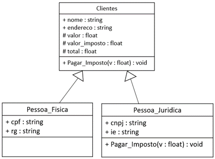

# Sistema de Controle de Clientes

## Descrição

- Os clientes podem ser pessoa física (com CPF e RG) ou pessoa jurídica (com CNPJ e Inscrição Estadual).
- A classe Pessoa_Fisica tem, ainda, os atributos específicos CPF e RG, e a classe Pessoa_Juridica tem os atributos específicos CNPJ e IE.
- O imposto para pessoa física é de 10% sobre o valor e, para pessoa jurídica, é 20%; e 90% dos clientessão pessoasfísicas.

## Diagrama de classes

